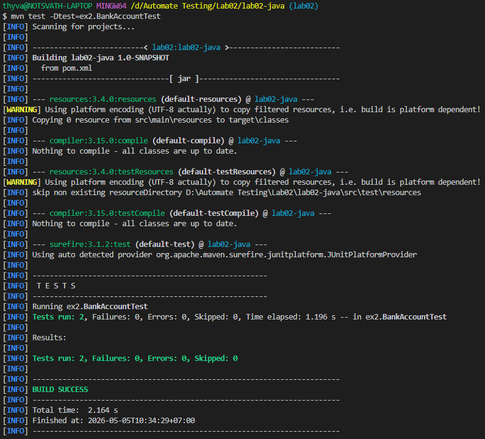
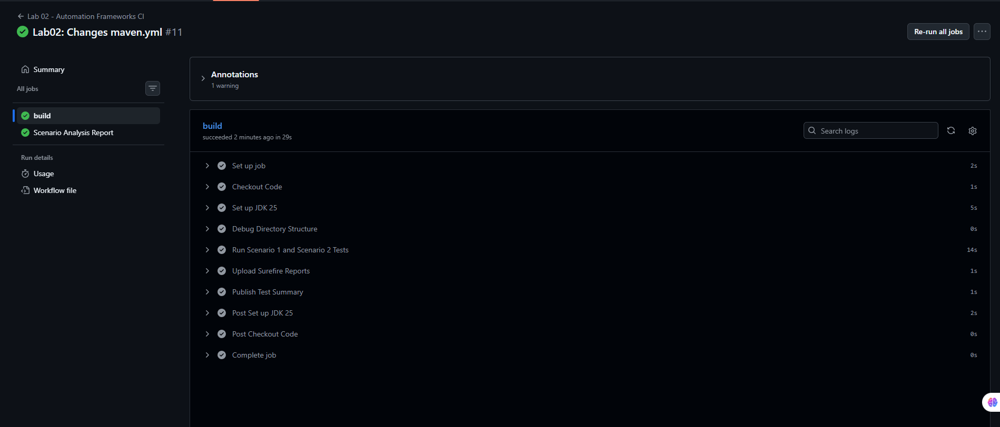
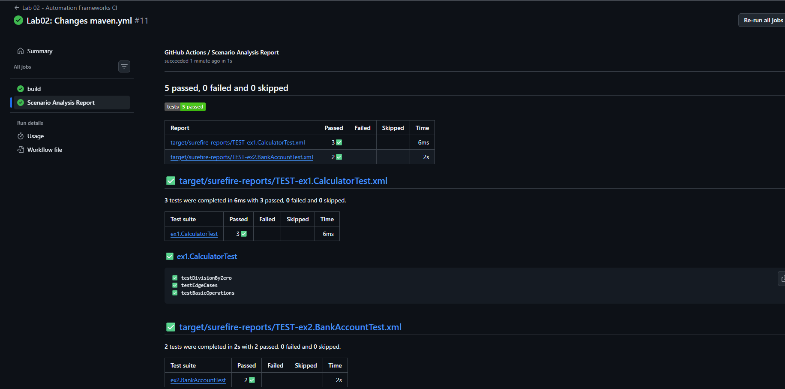

---

# LAB02 - TEST AUTOMATION FRAMEWORKS
**Student Name:** Thy Sethasarakvath  
**Frameworks:** JUnit 5, REST-assured, Maven, GitHub Actions

## Project Overview
This repository implements a structured automation framework based on modern software testing principles[cite: 1]. It covers mathematical validation (Calculator) and financial business rules (BankAccount) using both Blackbox and Whitebox testing approaches[cite: 1].

---

## 🧪 Scenario 1: Calculator Testing
**Objective:** Validate basic arithmetic operations with a focus on input validation and error handling[cite: 1].

### How to Run Locally:
```bash
mvn test -Dtest=ex1.CalculatorTest
```

### Key Features:
* **Blackbox Testing:** Verified mathematical correctness for addition, subtraction, and multiplication[cite: 1].
* **Whitebox Testing:** Implemented branch coverage to test exception paths, specifically ensuring the system handles division by zero correctly[cite: 1].
* **JUnit 5 Lifecycle:** Utilized modern annotations for clear test structure and execution[cite: 1].
**Output Screenshot:**
> 
---

## 🧪 Scenario 2: BankAccount Testing
**Objective:** Test complex financial business rules and state management using a combination of unit logic and API simulation[cite: 1].

### How to Run Locally:
```bash
mvn test -Dtest=ex2.BankAccountTest
```

### Key Features:
* **State Management:** Tracked internal account balance changes across successful withdrawal paths[cite: 1].
* **Regulatory Compliance:** Implemented logic to prevent withdrawals exceeding the current balance, simulating financial regulatory limits[cite: 1].
* **API Automation:** Integrated **REST-assured** to demonstrate BDD-style (Given-When-Then) testing against a mock API service[cite: 1].

**Output Screenshot:**
> 

---

## 🚀 CI/CD Integration (GitHub Actions)
**Objective:** Build a robust, scalable pipeline for continuous quality feedback[cite: 1].

### CI/CD Workflow:
The pipeline triggers on every push to the `lab02` branch, executing the following lifecycle:
1.  **Environment Setup:** Provisions an Ubuntu runner with **Oracle JDK 25**[cite: 1].
2.  **Automated Execution:** Runs the entire suite using Maven Surefire with specific targeting for `ex1` and `ex2` packages[cite: 1].
3.  **Artifact Storage:** Uploads comprehensive reports, including `.xml` and `.txt` logs, to the build artifacts for auditability[cite: 1].
4.  **Actionable Reporting:** Utilizes `dorny/test-reporter` to generate a visual summary of the scenario analysis within the GitHub UI[cite: 1].

### Workflow File:
The configuration is located at `.github/workflows/maven.yml`.

**Output Screenshot:**
> 
> 

---

## ⚙️ Prerequisites
* **Java:** JDK 25[cite: 1]
* **Build Tool:** Maven[cite: 1]
* **Testing Libraries:** JUnit 5, REST-assured, AssertJ[cite: 1]

---

## 📂 Project Structure
```text
├─ .
│  ├─ pom.xml
│  ├─ src/main/java/lab02/
│  │  ├─ ex1/code/Calculator.java
│  │  └─ ex2/code/BankAccount.java
│  └─ src/test/java/
│     ├─ ex1/CalculatorTest.java
│     └─ ex2/BankAccountTest.java
```