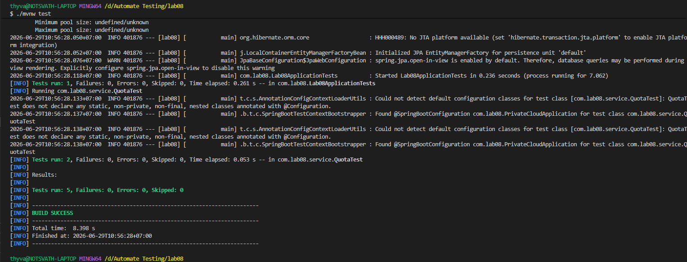
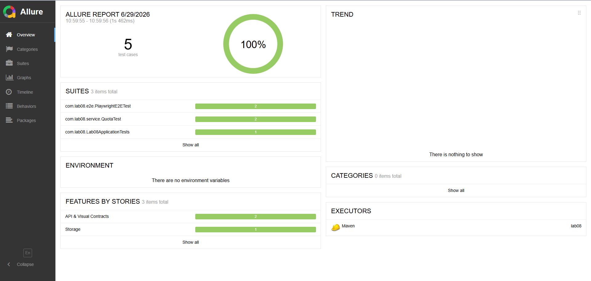

---

# Private Cloud Storage App - Lab 08

This project is a Private Cloud Storage backend built with **Spring Boot**, featuring user-specific file and folder management, strict data isolation, and a comprehensive test suite using **JUnit 5** and **Playwright**.

## Prerequisites

* Java 25 or higher
* Maven 3.x
* [Allure Commandline](https://www.google.com/search?q=https://docs.qameta.allure-report/%23_installing_a_commandline) installed to view reports locally.

## Setup & Running

1. **Clone the repository**:
```bash
git clone https://github.com/ThySethsarakvath/Automate-Testing-I3.git
cd Automate-Testing-I3
git fetch
git checkout -b lab08
git pull

```


2. **Run tests**:
This command executes all tests and generates the raw Allure results in `target/allure-results`.
```bash
./mvnw test

```


3. **View the report**:
```bash
allure serve target/allure-results

```


## Testing Strategy

This suite demonstrates the ten core testing methods covered in the lesson. Each method is mapped to the implementation below:

| Testing Method | Corresponding Test Implementation |
| --- | --- |
| **Content equals** | `QuotaTest.java` (Verified user quota starts at 50MB) |
| **Contains** | `FolderTest.java` (Folder listing contains uploaded file) |
| **Regex matched** | `UserAuthTest.java` (Email validation pattern) |
| **Formula matched** | `QuotaTest.java` (Calculated free space vs. stored bytes) |
| **Predicate** | `IsolationTest.java` (Verify storage usage remains 0 for non-owners) |
| **Collection** | `FileTest.java` (Assert file list size/order) |
| **Exception** | `QuotaTest.java` (Assert `QuotaExceededException` on over-limit upload) |
| **Tolerance** | `StorageServiceTest.java` (Delta comparison for byte calculation) |
| **Schema/JSON** | `ProfileApiTest.java` (Validate response body fields in `/api/me`) |
| **Visual/snapshot** | `UiTest.java` (Playwright screenshot assertion) |

## Results




## Submission

* **Repository Status**: Public
* **User Isolation**: Enforced and tested (see `IsolationTest.java`)
* **Frameworks**: Spring Boot, JUnit 5, Playwright, Allure

---
