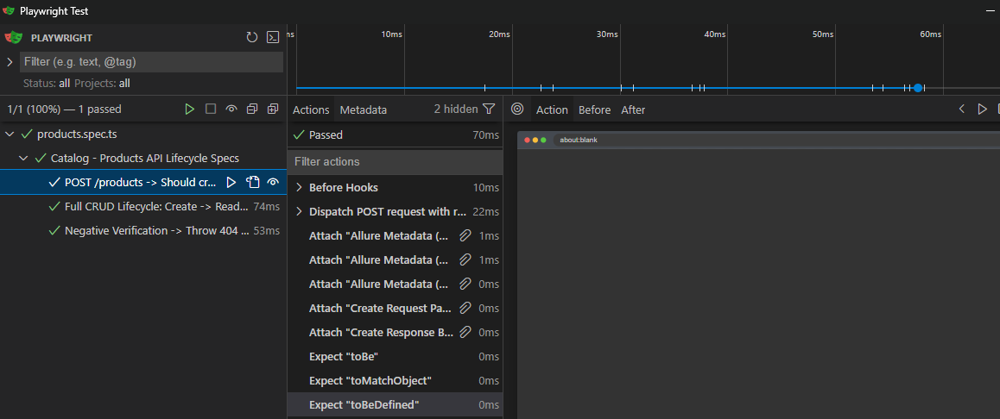
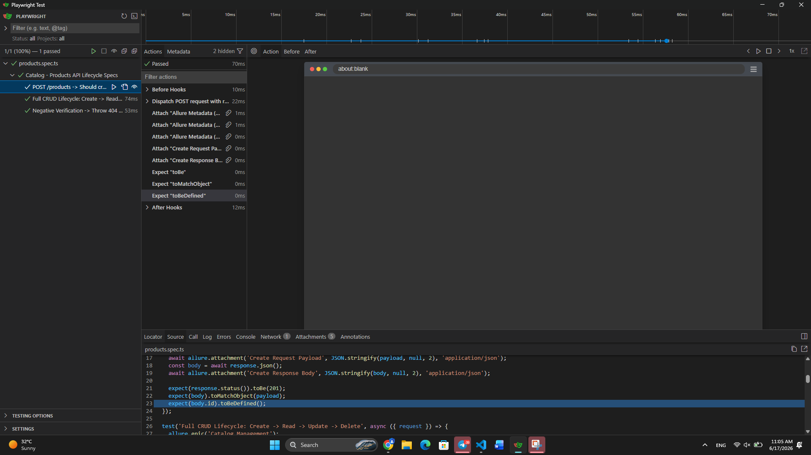
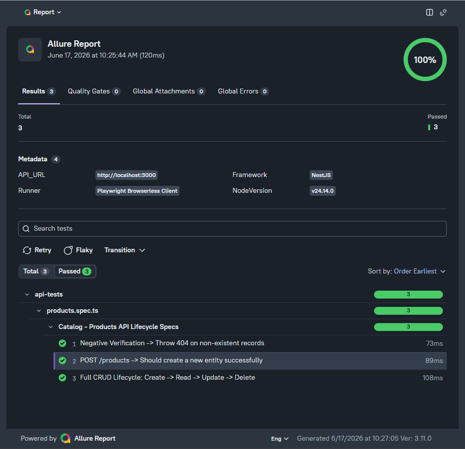
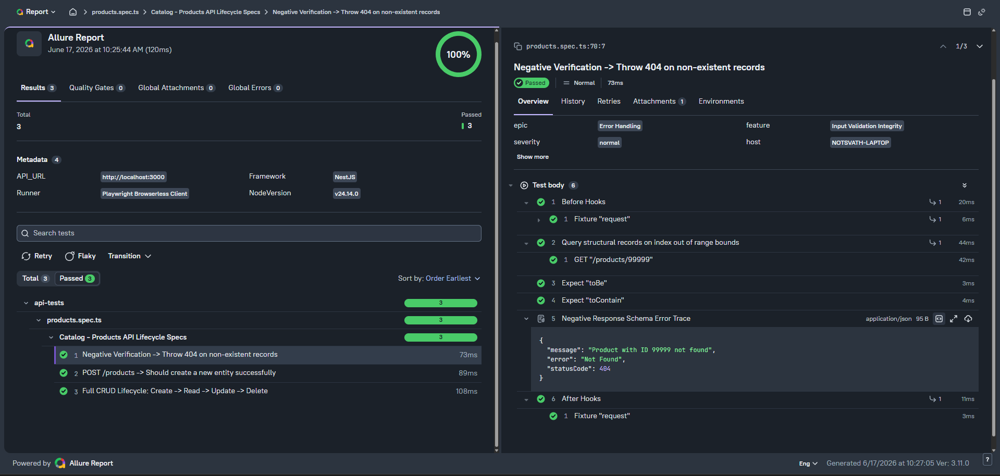
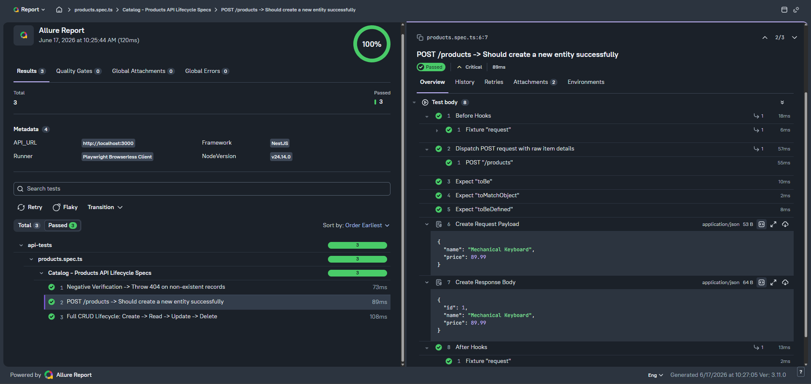
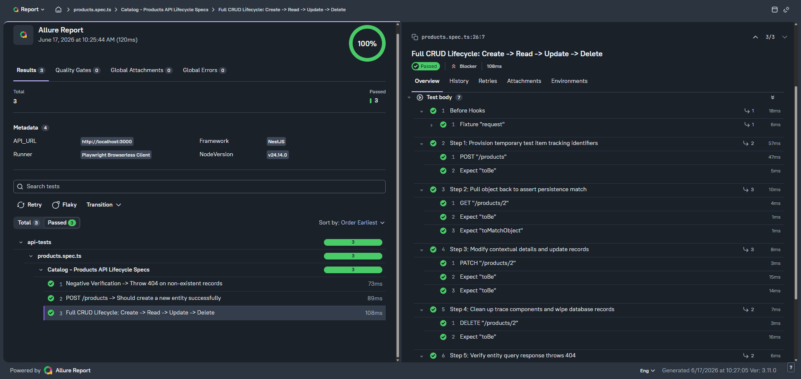

# Lab 07 Report: API Testing with NestJS, Playwright, and Allure

## 📌 Project Overview
This repository contains the complete implementation for **Lab 07 — API Testing: NestJS · Playwright · Allure**. The objective of this lab is to build a robust backend REST API using NestJS and implement a comprehensive end-to-end automated testing framework using Playwright's browserless HTTP request client, with enhanced interactive reporting powered by Allure.

---

## 🏗️ Project Architecture & Structure
The project is structured into two completely isolated micro-directories to decouple the System Under Test (SUT) from the Test Automation Framework:


```

```text
File generated successfully.

```text
lab07-api-testing/
├── shop-api/                  # System Under Test (SUT) - NestJS API
│   ├── src/
│   │   ├── products/
│   │   │   ├── dto/
│   │   │   │   ├── create-product.dto.ts
│   │   │   │   └── update-product.dto.ts
│   │   │   ├── products.controller.ts
│   │   │   ├── products.module.ts
│   │   │   └── products.service.ts
│   │   ├── app.module.ts
│   │   └── main.ts
│   └── package.json
│
└── api-tests/                 # Test Automation Framework - Playwright
    ├── tests/
    │   └── products.spec.ts   # Core CRUD and Negative Verification Specs
    ├── allure-results/        # Raw JSON telemetry data
    ├── allure-report/         # Static compiled interactive dashboard HTML
    ├── package.json
    └── playwright.config.ts   # Playwright configuration with auto-webServer and Allure setup

```

---

## 🛠️ Step-by-Step Implementation Guide

### Phase 1: Developing the NestJS API (`shop-api`)

1. **Scaffold the NestJS App & CRUD Resource:**
```bash
npm i -g @nestjs/cli
nest new shop-api --strict --package-manager npm
cd shop-api
nest g resource products --no-spec

```


*Selected REST API and enabled DTO generation when prompted.*
2. **Implement In-Memory CRUD Data Layer:**
* Configured `CreateProductDto` and `UpdateProductDto` under `src/products/dto/` to handle validation for `name` (string) and `price` (number).
* Formulated a production-like in-memory data store using array states in `products.service.ts` to manage complete persistence lifecycles dynamically without requiring heavy external database containers.
* Wired controllers in `products.controller.ts` to cleanly bind incoming HTTP verbs (`@Post()`, `@Get()`, `@Patch()`, `@Delete()`) to target workflows.


3. **Boot the API Server Locally:**
```bash
npm run start:dev

```


#### 📸 System Under Test Boot Checkpoint


---

### Phase 2: Building the Test Framework (`api-tests`)

1. **Initialize Playwright & Allure Dependencies:**
```bash
cd ../api-tests
npm init playwright@latest -- --yes
npm i -D allure-playwright allure-commandline

```


2. **Configure `playwright.config.ts` Engine Rules:**
Configured Playwright to execute pure API-based assertions in parallel, attach customized environment reports, and automatically manage the lifecycle of our NestJS backend application via the `webServer` option:
```typescript
import { defineConfig } from '@playwright/test';

export default defineConfig({
  testDir: './tests',
  fullyParallel: true,
  reporter: [['line'], ['allure-playwright', { resultsDir: 'allure-results' }]],
  use: {
    baseURL: 'http://localhost:3000',
    extraHTTPHeaders: { 'Accept': 'application/json', 'Content-Type': 'application/json' },
  },
  webServer: {
    command: 'cd ../shop-api && npm run start',
    url: 'http://localhost:3000/products',
    reuseExistingServer: !process.env.CI,
  },
});

```


3. **Formulate Comprehensive Testing Suites (`tests/products.spec.ts`):**
Wrote edge-case validations and end-to-end user-flow behaviors enriched with semantic Allure metadata structures:
* **`POST /products`:** Asserts status code `201 Created`, schema shape correctness, and non-empty property initialization.
* **Full CRUD Integrity Lifecycle:** Chain-links dynamic variables across an entire lifetime loop (`POST` 201 $\rightarrow$ capture `id` $\rightarrow$ `GET` 200 $\rightarrow$ `PATCH` 200 update value validation $\rightarrow$ `DELETE` 200 $\rightarrow$ query again to ensure `404 Not Found`).
* **Negative Verification:** Targets high out-of-bounds query parameters (`/products/99999`) to assert predictable error propagation structures and message contents.


---

## 🚀 Execution Commands & Live Visualization

Navigate into the `api-tests` directory to perform verification steps and capture status results:

### 1. Headless CLI Automation Run

Triggers headless parallel background calls. It verifies the contract layout rules and captures raw metadata values:

```bash
npm run test:api

```

#### 📸 Playwright Headless Execution Trace


---

### 2. Live Debugger UI Exploration Mode

Launches Playwright's native interactive browser dashboard interface to view timeline details, step durations, and payload configurations:

```bash
npx playwright test --ui

```

#### 📸 Playwright Desktop Test UI Dashboard




---

### 3. Interactive Business Allure Dashboard Report

Parses raw JSON artifacts stream logs directly from the execution traces and builds an interactive, browser-readable dashboard showing test steps, severity tags, and attached JSON bodies:

```bash
npm run report:serve

```

#### 📸 Final Compiled Allure Quality Metric Report






---

## 🤖 CI/CD Automation Quality Gate

To execute this complete suite on every branch update or pull request targetting the development environment branch context, we implemented `.github/workflows/api-tests.yml`:

```yaml
name: API Regression Automation Suite
on:
  push:
    branches: [ main, master, lab07 ]
  pull_request:
    branches: [ main, master, lab07 ]

jobs:
  api-test-execution:
    runs-on: ubuntu-latest
    steps:
    - uses: actions/checkout@v4
    - uses: actions/setup-node@v4
      with: { node-version: 20, cache: 'npm', cache-dependency-path: '**/package-lock.json' }
    - uses: actions/setup-java@v4
      with: { distribution: 'temurin', java-version: '17' }
    - name: Run Lab Suite
      run: |
        cd shop-api && npm ci
        cd ../api-tests && npm ci && npx playwright test
    - name: Archive Reports
      if: always()
      run: cd api-tests && npm run report:generate
    - uses: actions/upload-artifact@v4
      if: always()
      with:
        name: Interactive-Allure-API-Report
        path: api-tests/allure-report/

```

---