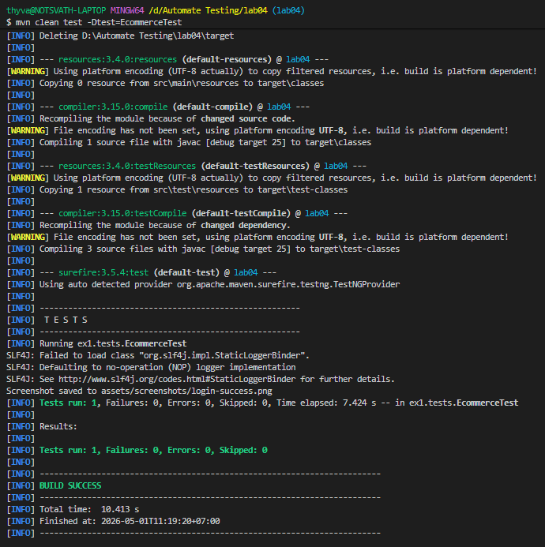
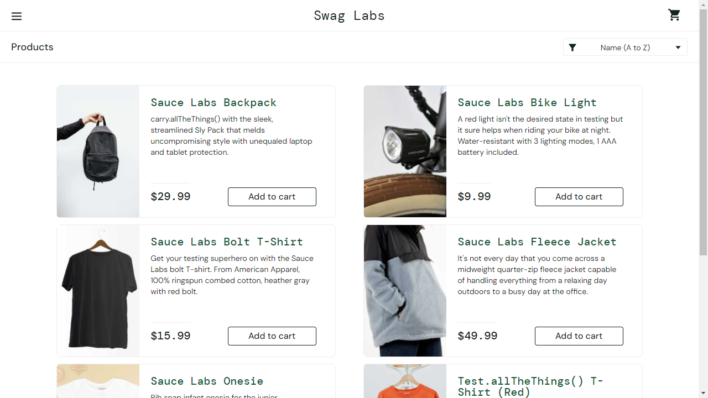
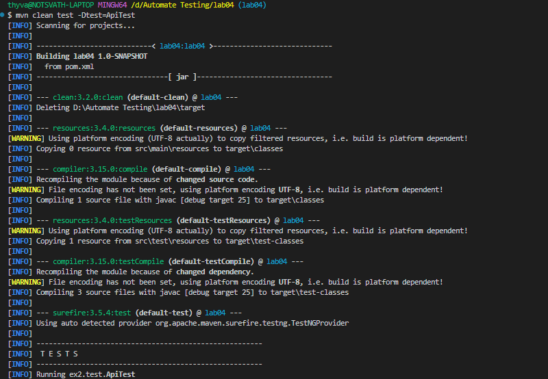
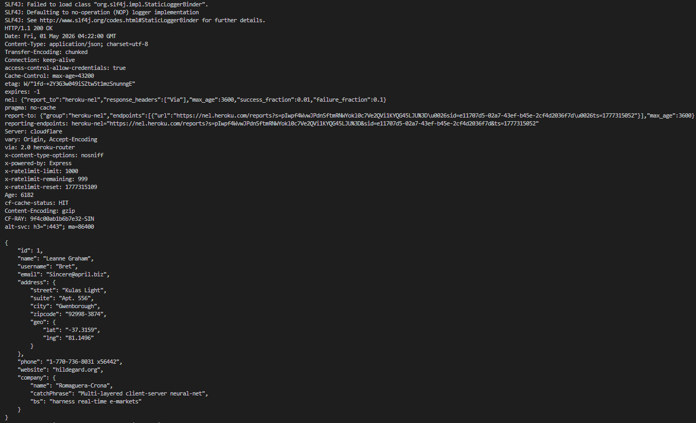
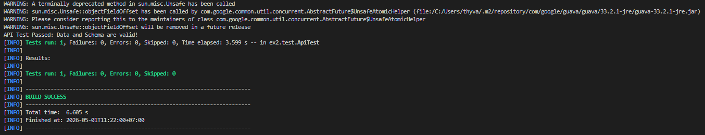

---

# Lab 04: Advanced Test Frameworks
**Student Name:** Thy Sethasarakvath  
**Focus:** Playwright UI Automation & REST-assured API Schema Validation  
**Tools:** Playwright, Rest-Assured, TestNG, Maven

## Project Overview
This lab demonstrates the implementation of modern testing frameworks. It covers the **Page Object Model (POM)** with Playwright for UI testing and **JSON Schema Validation** for backend API reliability.

---

## 🎭 Lab 1: E-commerce UI Automation (Playwright)
**Objective:** Implement a robust UI testing suite for Sauce Demo using Playwright and the Page Object Model.

### Key Implementations:
*   **Page Object Model (POM):** Created a `LoginPage` class to decouple locators from test scripts, improving maintainability.
*   **Browser Management:** Utilized Playwright’s optimized Chromium engine.
*   **Screenshot Capture:** Automatically generates a visual confirmation of successful login in the `screenshots/` directory.

### How to Run:
```bash
mvn test -Dtest=EcommerceTest
```

**Output Screenshot:**

logs:
> 

After-loged in Successfully:
> 

---

## 📡 Lab 2: API Testing Framework (REST-assured)
**Objective:** Build an API test suite with structural validation using JSON Schemas.

### Key Implementations:
*   **REST-assured DSL:** Implemented a BDD-style (`given/when/then`) test suite for RESTful services.
*   **JSON Schema Validation:** Integrated `json-schema-validator` to ensure API responses match the defined architectural contract (data types, required fields).
*   **Detailed Reporting:** Enabled full console logging (`.log().all()`) to capture request/response headers and bodies for debugging.

### How to Run:
```bash
mvn test -Dtest=ApiTest
```

**Output Screenshot:**
> 
> 
> 

---

## 📂 Project Structure
```text
lab04
├── src/main/java/pages       # Page Object Model classes
├── src/test/java/tests       # TestNG test suites (UI & API)
├── src/test/resources/ # JSON Schema definitions
├── assets/screenshots               # UI test execution evidence
└── pom.xml                   # Project dependencies
```

## ⚙️ Prerequisites
*   **Java:** JDK 25
*   **Playwright:** Initialized via `mvn exec:java -e -Dexec.mainClass=com.microsoft.playwright.CLI -Dexec.args="install"`
*   **Maven:** 3.9+

---
