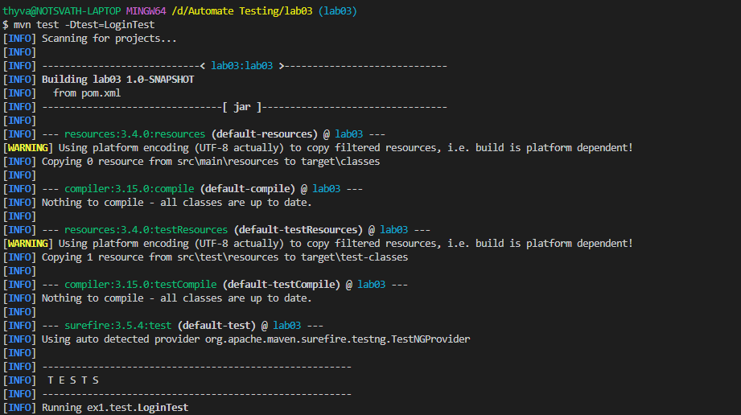
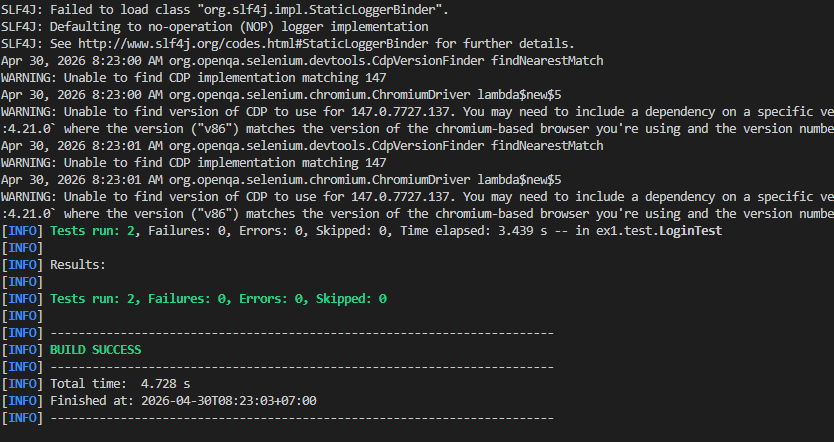
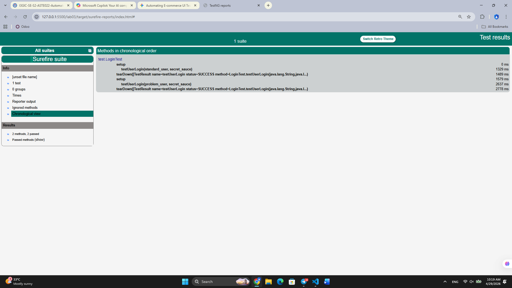
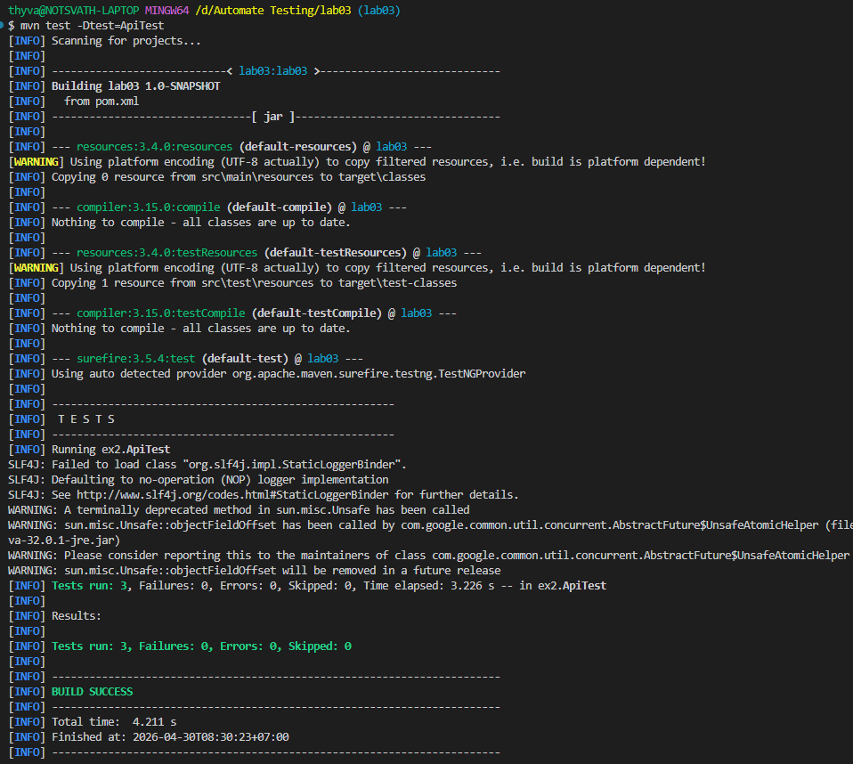
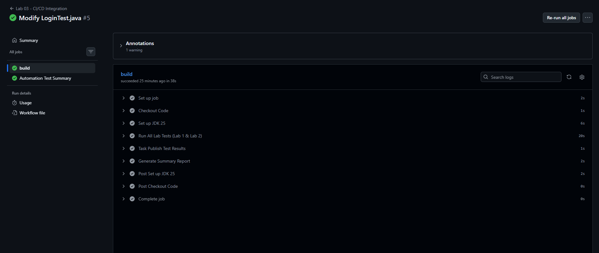
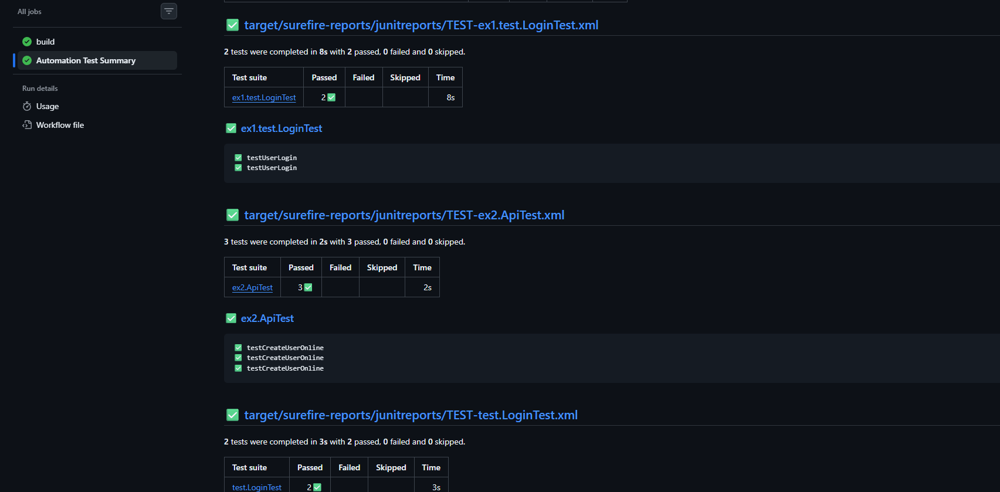

---

# LAB03 - TESTING FRAMEWORKS
**Student Name:** Thy Sethasarakvath   
**Frameworks:** Selenium, RestAssured, TestNG, Maven, GitHub Actions

## Project Overview
This repository contains a series of automation labs covering end-to-end (E2E) UI testing, RESTful API testing, and CI/CD pipeline integration.

---

## 🧪 Lab 1: UI Automation (Sauce Demo)
**Objective:** Automate the login process for the Sauce Demo e-commerce site using Selenium.

### How to Run Locally:
```bash
mvn test -Dtest=LoginTest
```

### Key Features:
* Automated login with valid credentials.
* **Headless Mode:** Configured for compatibility with Linux-based CI/CD runners.
* **Assertions:** Verified successful navigation to the inventory page.

**Output Screenshot:**
> 
> 

TestNG - Report:
> 

---

## 🧪 Lab 2: API Automation (RestAssured)
**Objective:** Test backend API endpoints for user management and category services.

### How to Run Locally:
```bash
mvn test -Dtest=ApiTest
```

### Key Features:
* **RESTful Testing:** Implemented GET, POST, PUT, and DELETE requests.
* **Status Code Verification:** Ensured correct HTTP response codes (200, 201, 204).
* **JSON Parsing:** Validated response body content.

**Output Screenshot:**
> 

---

## 🚀 Lab 3: CI/CD Integration (GitHub Actions)
**Objective:** Automate the entire test suite execution using a cloud-based pipeline with parallel execution and reporting.

### CI/CD Workflow:
The pipeline is triggered automatically on every push to the `lab03` branch. It performs the following steps:
1.  **Environment Setup:** Configures JDK 25 on an Ubuntu runner.
2.  **Parallel Execution:** Runs `LoginTest` and `ApiTest` simultaneously using Maven Surefire.
3.  **Artifact Publishing:** Uploads raw XML/HTML reports as build artifacts.
4.  **Result Reporting:** Generates a visual "Automation Test Summary" using `dorny/test-reporter`.

### Workflow File:
The configuration is located at `.github/workflows/maven.yml`.

### How to View Results:
1.  Navigate to the **Actions** tab in this repository.
2.  Select the latest run for **"Lab 03 - CI/CD Integration"**.
3.  Click the **"Automation Test Summary"** tab to see the test breakdown.

**Output Screenshots:**
> 
> 

---

## ⚙️ Prerequisites
* **Java:** JDK 25
* **Build Tool:** Maven 3.9+
* **Browser:** Google Chrome (Headless mode enabled for CI)

---